# MEAN Stack application with GCP Cloud Run

### What does MEAN?

**_MongoDB_** : For this demo we are using a Serverless MongoDB Atlas Cluster. 

**_Express.js_** : is a Node.js web application framework for building APIs.

**_Angular_** : is a client-side JavaScript platform.

**_Node.js_** : is a server-side JavaScript runtime environment. The server uses the MongoDB Node.js driver to connect to the database and retrieve and store data. 


### Assumptions:
1. User already has a Atlas environment and has access to create a new cluster.
2. User already has access to a GCP cloud project.

## For this demo
1. Create an Atlas Serverless cluster.
2. Setup GCP Cloud Run .
3. Setup Server.
4. Setup Application client.


### 1. Create an Atlas Serverless cluster 

1. login to Atlas from http://account.mongodb.com/account. If you are a new user Sign up to Atlas.
2. Click on create cluster button on top right of your screen.
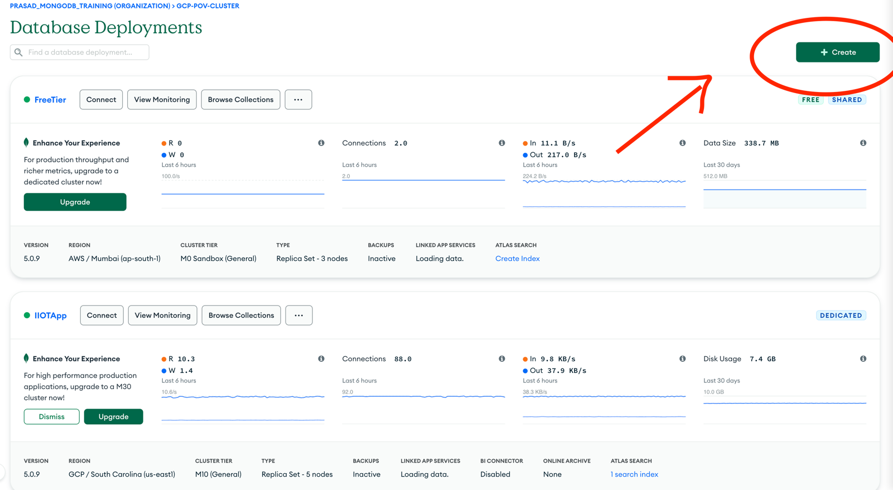


3. Select Serverless instance and then select on Google cloud. Click on create cluster. The serverless cluster creation will take a couple of minutes to complete. 
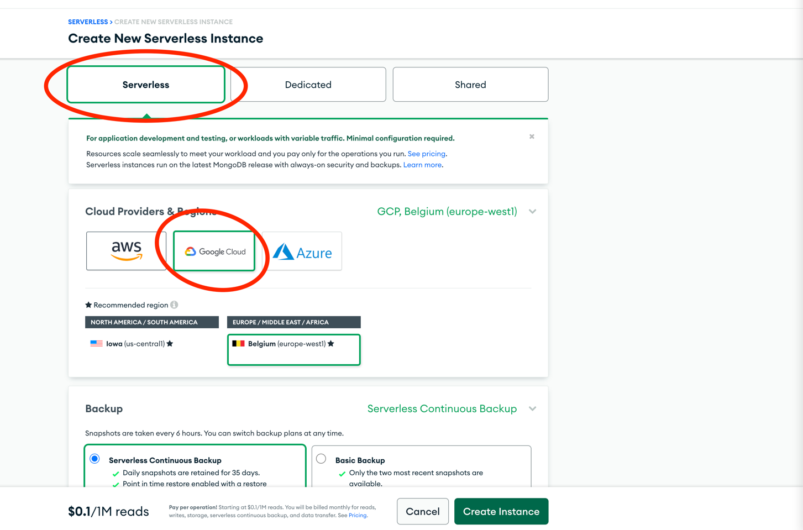


4. Add Database user by navigating to Database access. And Whitelist the ip address to allow access to the cluster.For this Demo will use Allow Access from Anywhere(Whitelist 0.0.0.0/0).
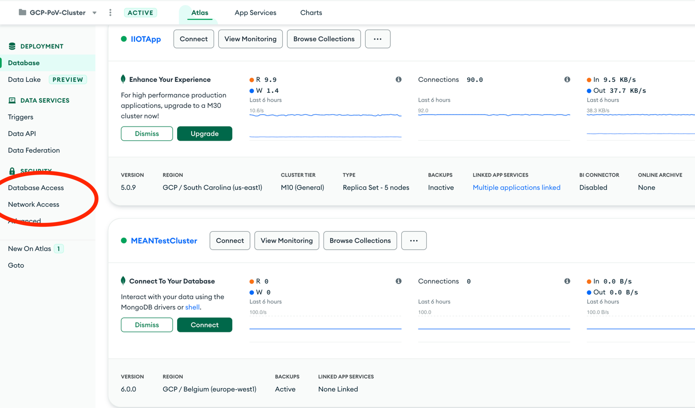


5. Note down the connection URI by clicking **_connect_** -> **_Connect your Application_** -> Driver: **_Node.js_** -> Version : **_4.1 or later_**
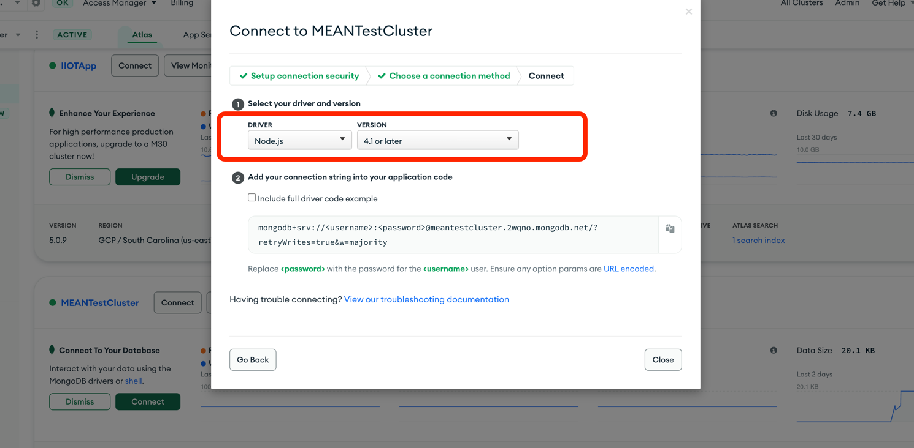

6. Please make sure you replace the <username> and <password> in the connection URI.


### 2. Setup GCP cloud Run.
1. Enable cloud Run API through UI or by running the command.

```gcloud services enable run.googleapis.com --project <project name>```
2. Clone this Repo to your Cloud shell terminal using below command.

```git clone https://github.com/mongodb-developer/mean-stack-example.git```


3. To Start the cloud editor, Click on Cloud Shell Terminal -> and Click on Cloud editor as shown below.
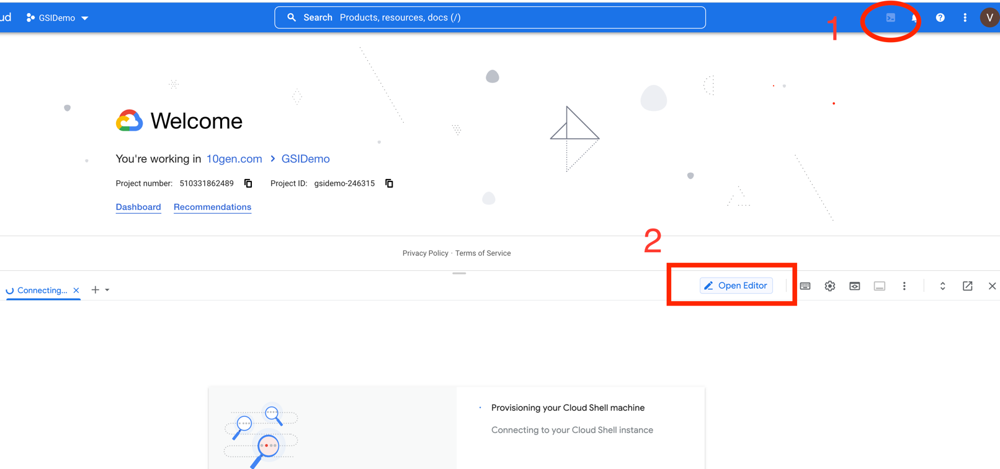


### 3.Setup Server 

1. Once you open the Editor, You will be able to see the project that you have cloned.
2. First, We will setup the server. 
    * To run the server navigate to **_Cloud Run_** -> **_Deploy to Cloud Run_** as shown below.
    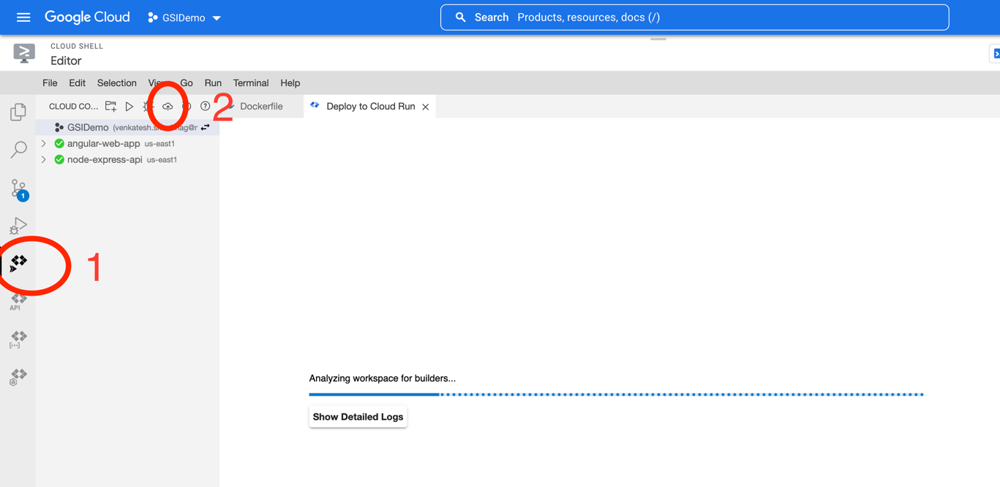
    * Fill the below properties and click on create service. 
      - Service Name: node-express-api 
      - Deployment platform: Cloud Run (fully managed)
      - Authentication: Allow UnAuthenticated invocations.
    * Under Revision Settings, click on Show Advanced Settings to expand them:
      - Container port: 5200
      - Environment variables: 
      ```ATLAS_URI:mongodb+srv:/<username>:<password>@sandbox.pv0l7.mongodb.net/meanStackExample?retryWrites=true&w=majority```
    * Finally, in the Build Settings section, select:
      - Builder: Docker
      - Docker: server/Dockerfile


7. Once the Server service is created. Copy the URL as shown below.
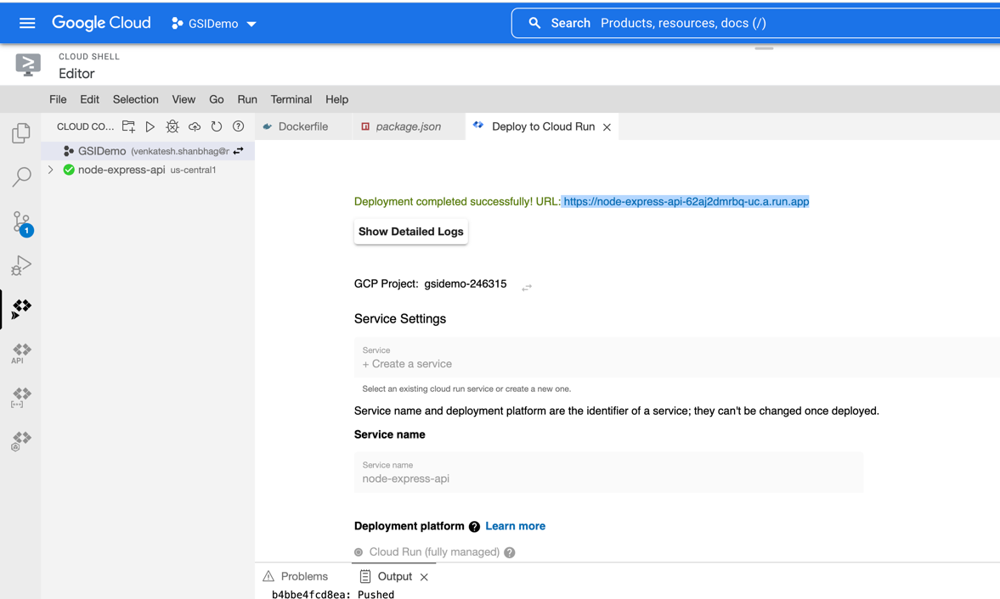


### 4. Deploy Express and Node.js REST API
1. Navigate to the file `mean-stack-example/client/src/app/employee.service.ts` and update the private url with the Server Deployment URL as shown below.
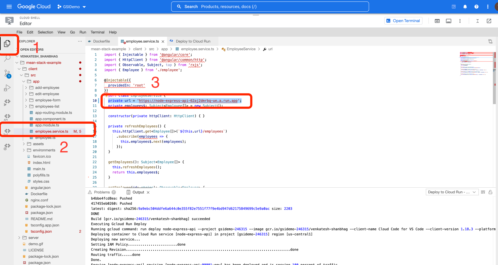


2. Navigate to **_Cloud Run_** -> **_Deploy to Cloud Run_** as shown in step 6.
3. Fill in the properties as below.
   * Create a new service for client.
       - Service Settings: Create a service
       - Service name: angular-web-app
       - Deployment platform: Cloud Run (fully managed)
       - Authentication: Allow unauthenticated invocations
   * For the Build environment, select Cloud Build. 
   * Finally, in the Build Settings section, select:
     - Builder: Docker
     - Docker: client/Dockerfile

Click on Deploy.
 

## Access The deployed application.

To Access the deployed application **_Click_** on the url generated as shown below.
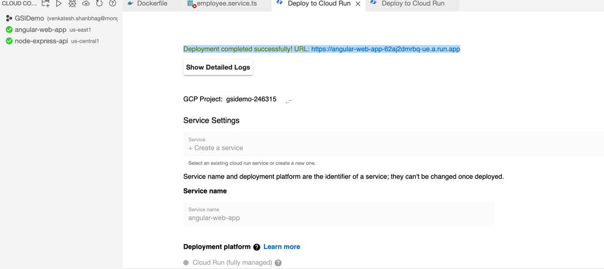


This will open a webpage application. Create some entries using UI.
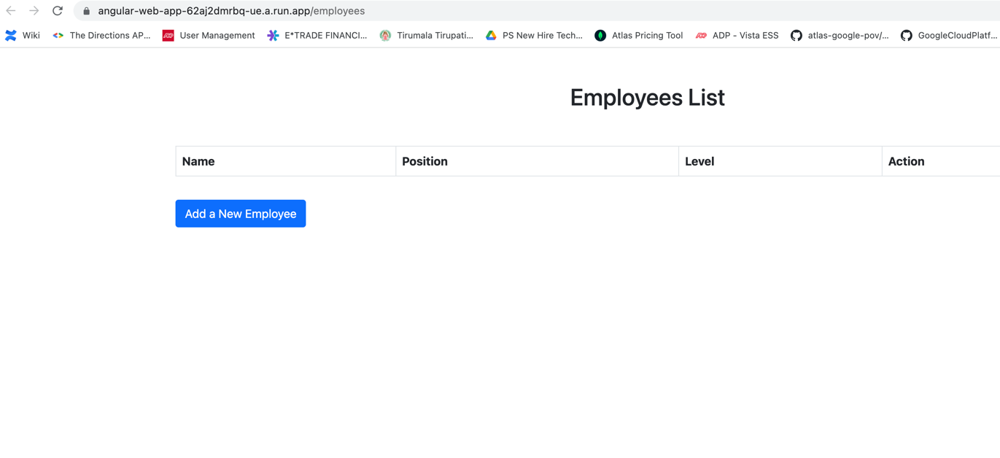

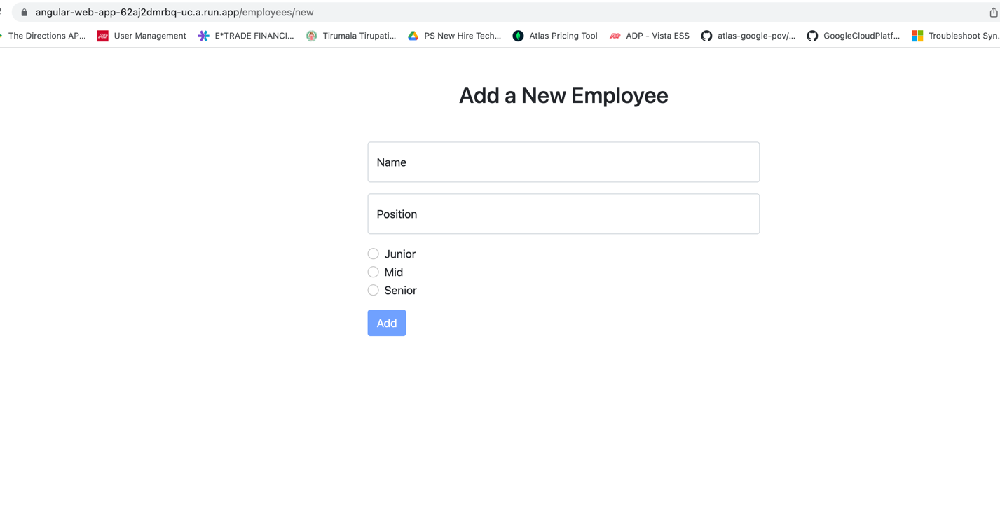

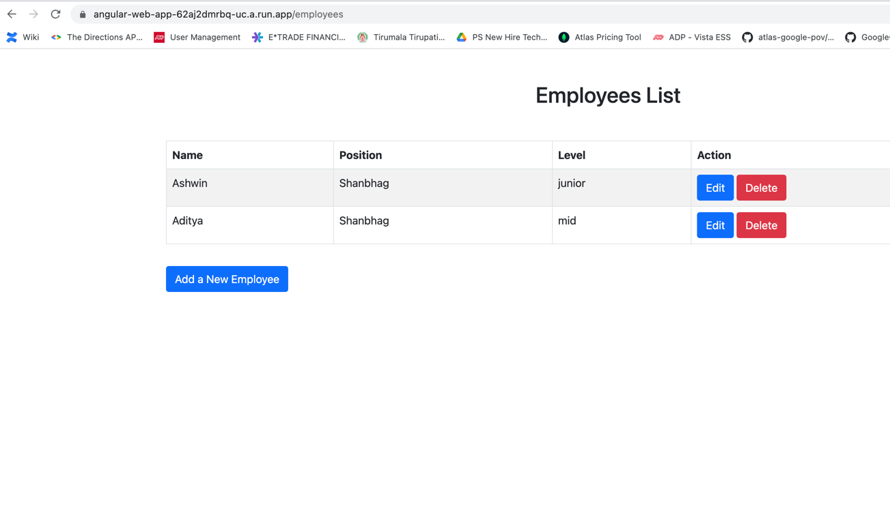


Once you create couple on new entries. Navigate to your atlas cluster. You should be able to see all these entries in your cluster as well.

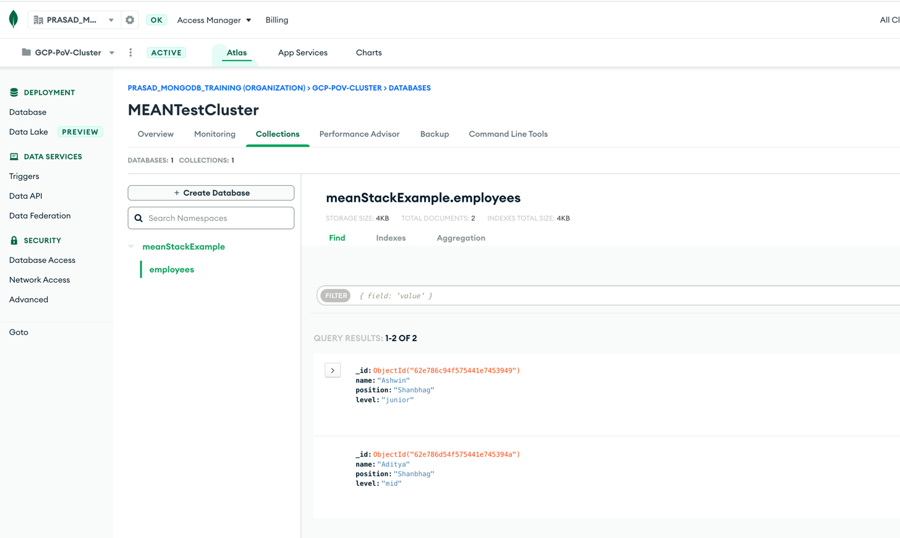

# Conclusion:


# Reference:

